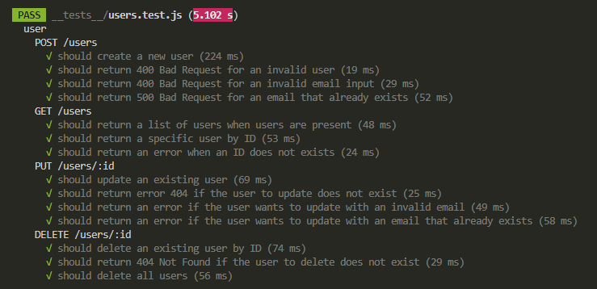
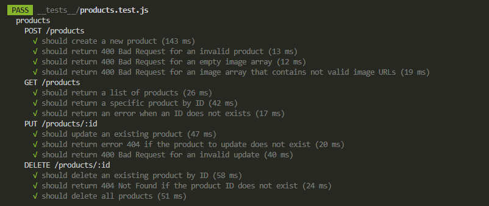
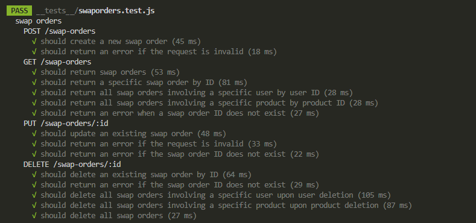
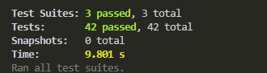

# WELCOME TO LOOKBOOK!👕☀️
At LookBook, we believe in the power of *sustainability* and *circular economy*. Our goal is to promote the reuse and exchange of pre-loved fashion items. By connecting users and products in a meaningful way, we contribute to *reducing waste* and embracing a more eco-friendly lifestyle! 💚🌍👗

LookBook is my **Node.js** project for the Start2Impact's master in Full Stack Development. This application implements fantastic RESTful APIs for managing users, second hand products, and swap orders.

For further details please take a look at the presentation inside the repo.
Are you ready to explore our amazing APIs? 🎉

- [Introduction](#introduction)
- [Tech Stack](#tech-stack)
- [Quick Start](#quick-start)
- [API Documentation](#api-documentation)
  - [Users](#users)
  - [Products](#products)
  - [Swap Orders](#swap-orders)
- [Sanitization and Validation](#sanitization-and-validation)
- [Testing](#testing)
- [Contacts](#contacts)

## TECH STACK ⛓️
- **Node.js**: A runtime environment for executing JavaScript code on the server-side.
- **Express.js**: A web application framework for building robust and efficient web applications.
- **Express Validator**: A set of express.js middlewares and sanitizer functions.
- **Nodemon**: A tool that helps develop Node.js based applications by automatically restarting the node application when file changes are detected.
- **MongoDB**: A NoSQL database that stores data in flexible, JSON-like documents.
- **Mongoose**: A library for MongoDB and Node.js.
- **MongoDB Memory Server**: A in-memory MongoDB server for testing purposes.
- **Jest**: A JavaScript testing framework.
- **Supertest**: A library for testing HTTP assertions.

## QUICK START 🚀
To get started, follow these simple steps:

1. Clone the Repo: `git clone https://github.com/diegoddie/S2I_FullStack_NodeJS.git`
2. Install Dependencies: `npm install` and `cd NodeJS`
3. Configure your MongoDB Database: Go to https://www.mongodb.com/atlas/database and create a new free cluster DB. 
4. Create a .env file in the root of your project and add the MONGODB_URI variable with your MongoDB database URL.
5. Start the Application: `npm run dev`
6. Use Postman to try all the APIs (more details in the *API Documentation* section).
7. View Your Data in MongoDB Atlas: You can check how documents are managed in your MongoDB Atlas database to see the results of API operations.
8. Open a new terminal and run tests: `npm test`

## API DOCUMENTATION 🌎
Here's a list of the amazing APIs at your disposal:

### Users 
- **GET /users**: Returns a list of all users.
- **GET /users/:id**: Returns a specific user based on the ID.
- **POST /users**: Creates a new user.
    - Request Body Fields:
        - `firstName`: The first name of the user (required).
        - `lastName`: The last name of the user (required).
        - `email`: The email address of the user (required). It must be a valid email format and not already in use.
- **PUT /users/:id**: Updates an existing user based on the ID.
- **DELETE /users**: Deletes all users.
- **DELETE /users/:id**: Deletes a user based on the ID.

*When a user is deleted, associated swap orders are automatically removed.*

### Products 
- **GET /products**: Returns a list of all products.
- **GET /products/:id**: Returns a specific product based on the ID.
- **POST /products**: Creates a new product.
    - Request Body Fields:
        - `name` (required): The name of the product.
        - `image` (required): An array of URLs for the product images (1 URL minimum). Each URL must be a valid HTTP, HTTPS, or FTP link.
- **PUT /products/:id**: Updates an existing product based on the ID.
- **DELETE /products**: Deletes all products.
- **DELETE /products/:id**: Deletes a product based on the ID.

*When a product is deleted, associated swap orders are automatically removed.*

### Swap Orders
- **GET /swap-orders**: Returns a list of all swap orders.
- **GET /swap-orders/:id**: Returns a specific swap order based on the ID.
- **GET /swap-orders/user/:id**: Returns swap orders associated with a specific user.
- **GET /swap-orders/product/:id**: Returns swap orders associated with a specific product.
- **POST /swap-orders**: Creates a new swap order.
    - Request Body Fields:
        - `products` (required): An array of product IDs involved in the swap order. At least 2 unique product IDs are required.
        - `users` (required): An array of user IDs involved in the swap order. Exactly 2 unique user IDs are required.
- **PUT /swap-orders/:id**: Updates an existing swap order.
- **DELETE /swap-orders**: Deletes all swap orders.
- **DELETE /swap-orders/:id**: Deletes a swap order based on the ID.

## SANITIZATION AND VALIDATION ✨
All user inputs are sanitized and validated to prevent common security issues such NoSQL Injection. This project utilizes Express Validator and follows best practices to ensure the safety and security of your data.

## TESTING 💻
This project includes 3 comprehensive and documented test suites with a total of 43 tests, created using Jest and Supertest. You can run these tests using the following command in a new terminal:
`npm test`

## CONTACTS 👋🏻
- Email: diego.boost@gmail.com
- Personal Website: https://diego-lauricella.netlify.app
- Github: https://github.com/diegoddie
- Fiverr: https://www.fiverr.com/diegoddie 
- Upwork: https://www.upwork.com/freelancers/~01021369935709b658 